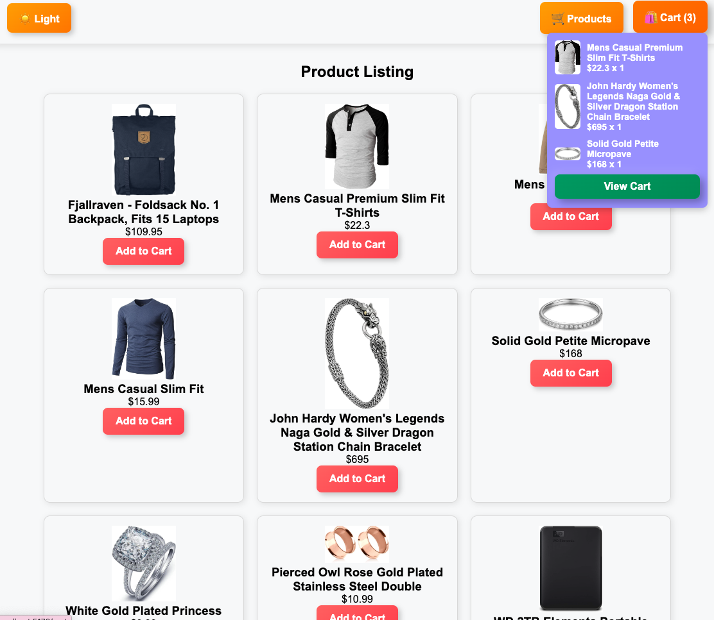
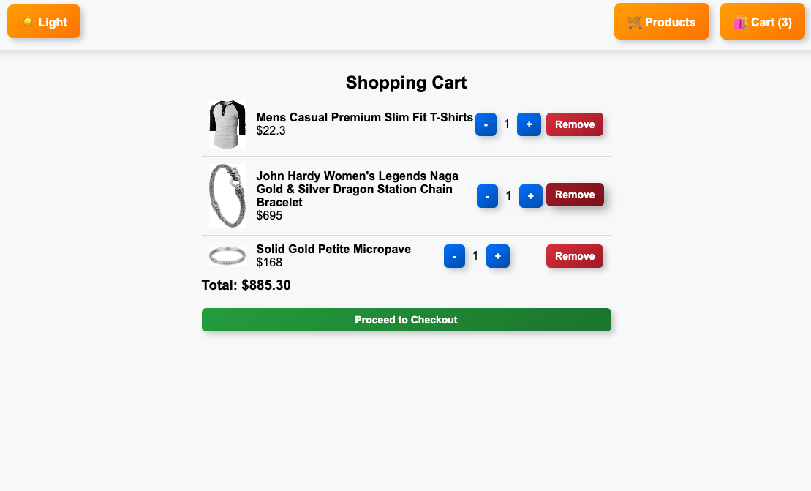
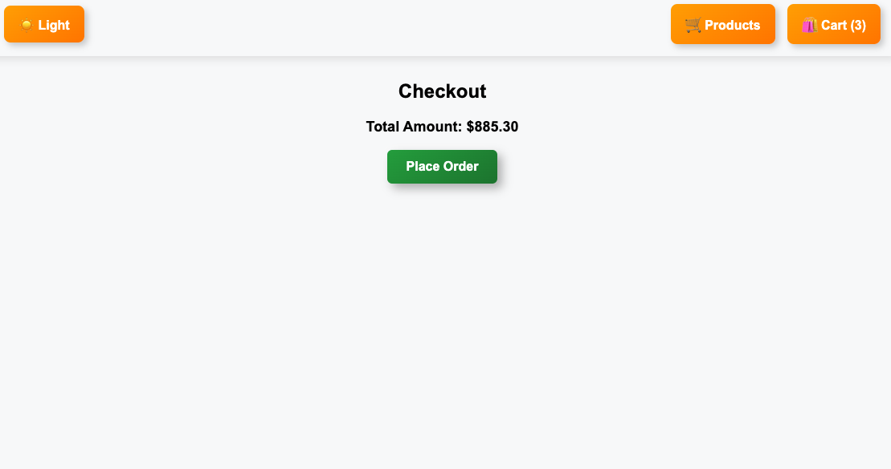

# Inventory Management System

This is an inventory management system built using React and Redux. It allows users to browse products, add them to a cart, and proceed to checkout. The UI includes dark and light mode with a modern layout.

## Features

- Product listing in a grid layout
- Add and remove items from the cart
- Live cart preview with full item details
- Dark and light mode toggle
- Fixed navbar with improved styling
- Enhanced button hover effects
- Interactive cart dropdown
- Seamless checkout process


## Screenshots







## Installation

1. Clone the repository:
   ```sh
   git clone https://github.com/sumeetbidhan/inventory-management-system
   cd inventory-management-redux
   ```
2. Install dependencies:
   ```sh
   npm install
   ```
3. Start the development server:
   ```sh
   npm start
   ```
   The app will be available at `http://localhost:3000`.

## Folder Structure

```
📦 inventory-management-redux
 ┣ 📂 src
 ┃ ┣ 📂 components
 ┃ ┣ 📂 pages
 ┃ ┣ 📂 redux
 ┃ ┣ 📂 styles
 ┃ ┣ 📜 App.js
 ┃ ┗ 📜 index.js
 ┣ 📜 .gitignore
 ┣ 📜 package.json
 ┗ 📜 README.md
```

## Usage

- Browse products on the home page.
- Add products to the cart and view details.
- Toggle dark and light mode.
- Proceed to checkout.

## Contributing

Contributions are welcome. To contribute:
1. Fork the repository
2. Create a new branch
3. Make changes and submit a pull request

## License

This project is licensed under the MIT License.
